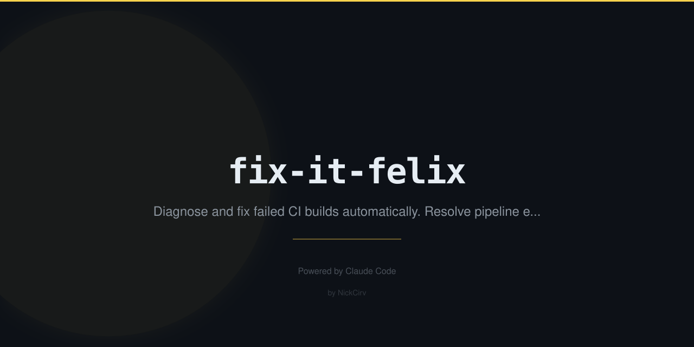

# fix-it-felix

> Self-healing CI. Auto-fixes failed builds.

[](https://github.com/NickCirv/fix-it-felix/stargazers)
[](LICENSE)
[](https://github.com/marketplace/actions/fix-it-felix)

## The Problem

CI fails. You context-switch from whatever deep work you were doing. You open the logs. You read 300 lines of noise to find one typo. You fix it. You push. CI fails again, different error. What if CI could just... fix itself? Felix reads the logs, finds the bug, fixes the code, and pushes — while you stay in flow.

## Quick Start

Add Felix to your existing workflow. It only runs when the build breaks:

```yaml
# .github/workflows/ci.yml
name: CI
on: [push, pull_request]

jobs:
  build:
    runs-on: ubuntu-latest
    steps:
      - uses: actions/checkout@v4
      - run: npm install
      - run: npm test

  felix:
    needs: build
    if: failure()
    runs-on: ubuntu-latest
    permissions:
      contents: write
      pull-requests: write
      actions: read
    steps:
      - uses: actions/checkout@v4
      - uses: NickCirv/fix-it-felix@v1
        with:
          anthropic-api-key: ${{ secrets.ANTHROPIC_API_KEY }}
        env:
          GITHUB_TOKEN: ${{ secrets.GITHUB_TOKEN }}
```

Then add your key to GitHub Secrets: `Settings → Secrets → ANTHROPIC_API_KEY`.

## Example Output

Felix leaves a comment on the failing PR explaining exactly what it fixed:

```
🔧 Fixed it for you!

The `npm test` step failed because `getUserById` was called with a string
ID but the function signature expects a number.

  Before: getUserById(req.params.id)
  After:  getUserById(Number(req.params.id))

Changed: src/services/users.ts · See commit abc1234
Confidence: High · Attempts: 1/3
```

## Features

- **Zero config** — drops into any existing CI workflow in 8 lines of YAML
- **Reads real logs** — fetches the actual GitHub Actions failure output, not a guess
- **Minimal diffs** — typically 1-5 line fixes, not rewrites
- **Verified fixes** — re-runs the failing command before pushing
- **PR comments** — explains what broke and what was changed
- **Safe loop prevention** — gives up after 3 attempts, never infinite-loops
- **Outputs** — exposes `fixed`, `explanation`, and `sha` for downstream steps

## How It Works

1. Felix triggers only when the `build` job fails (`if: failure()`)
2. Reads the full CI failure logs from the GitHub Actions API
3. Analyzes the error — wrong type, bad import, missing dep, test assertion, etc.
4. Makes the minimal code change needed to fix it
5. Re-runs the failing command locally to verify the fix works
6. Pushes the fix and comments on the PR with a plain-English explanation

## Requirements

- `ANTHROPIC_API_KEY` as a GitHub Actions secret
- Workflow permissions: `contents: write`, `pull-requests: write`, `actions: read`

**Configuration**

| Input | Default | Description |
|-------|---------|-------------|
| `anthropic-api-key` | required | Your Anthropic API key |
| `auto-push` | `true` | Push fixes automatically |
| `max-attempts` | `3` | Max fix attempts before giving up |

**Outputs**

| Output | Description |
|--------|-------------|
| `fixed` | `"true"` if a fix was successfully applied |
| `explanation` | One-sentence description of what was fixed |
| `sha` | Short commit SHA of the fix |

## See Also

- [sleep-and-ship](https://github.com/NickCirv/sleep-and-ship) — Queue tasks at night, wake up to shipped features
- [pr-poet](https://github.com/NickCirv/pr-poet) — AI-written PR descriptions that actually make sense
- [ghost-mode](https://github.com/NickCirv/ghost-mode) — Ship features without breaking prod

## License

MIT — [NickCirv](https://github.com/NickCirv)
